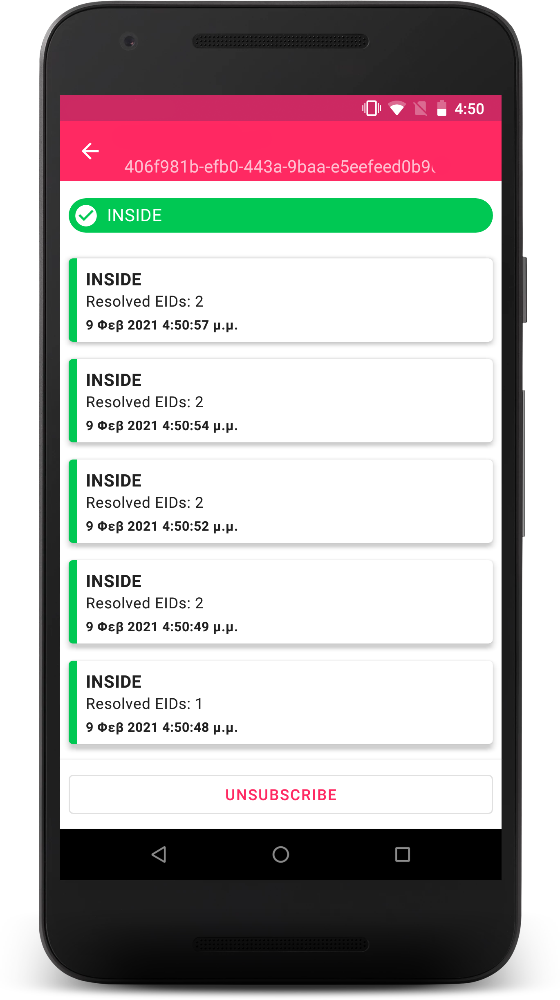

# Bespot Android SDK

[](#)
[](#)



[Bespot](https://bespot.com/) Android SDK offers indoor location tracking and analytics reporting to 3rd party apps using BLE technology and Machine Learning.

## Features

- [x] Indoor location (in/out)
- [ ] Indoor area detection
- [ ] Outdoor location
- [ ] Analytics

## Installation

Add the Bespot Artifactory repository to your root `build.gradle`.

```gradle
allprojects {
    repositories {
        maven {url 'https://bespot.jfrog.io/artifactory/bespot-sdk-android/'}
    }
}
```

And then add the dependency in your project's `build.gradle`:

```gradle
dependencies {
    implementation "com.bespot:library:${latest_version}"
}
```

## Usage

First initialise Bespot SDK with the provided **App Id** and **App Secret**
```kotlin
Bespot.init(this, "your_app_id", "your_secret", null)
```
or via sample project's `build.gradle` file
```kotlin
buildConfigField("String", "BESPOT_APP_ID", "\"$BESPOT_APP_ID\"")
buildConfigField("String", "BESPOT_APP_SECRET", "\"$BESPOT_APP_SECRET\"")
```

The Bespot SDK requires three permissions. It needs permission for [Fine Location](https://developer.android.com/reference/android/Manifest.permission#ACCESS_FINE_LOCATION), for [Bluetooth](https://developer.android.com/reference/android/Manifest.permission#BLUETOOTH) and for [Bluetooth Admin](https://developer.android.com/reference/android/Manifest.permission#BLUETOOTH_ADMIN).

#### Subscribe for indoor location events

In order to receive indoor location changes you need to subscribe to `Bespot.subscribe`. This will return a 'StatusResult' object with the status of the device.

```kotlin
Bespot.subscribe(object: StatusObserver {
    override fun onStatusUpdate(status: StatusResult) {
        // Handle new status
    }

    override fun onError(error: Failure) {
        // Handle error
    }
}, null, null)
```

For the unsubscribe procedure use the `Bespot.unsubscribe`

```kotlin
 override fun onPause() {
    Bespot.unsubscribe()
    super.onDestroy()
}
```

#### Request for last status

When the last status of the device is needed, you can retrieve it by calling the `Bespot.lastStatus`. This will return a `StatusResult` object.

```kotlin
Bespot.lastStatus(object: StatusObserver {
    override fun onStatusUpdate(status: StatusResult) {
        // Handle status
    }

    override fun onError(error: Failure) {
        // Handle error
    }

})
```

#### Request for stores

To receive the available stores, call the `Bespot.getStores`.

```kotlin
Bespot.getStores(object: StoresCallback {
    override fun onStoreReceived(stores: List<Store>) {
        // Handle available stores
    }

    override fun onError(error: Failure) {
        // Handle error
    }
})
```

#### Request for store information

You can request for information about a store by using the `Bespot.getStore` method and passing the `store_id`.

```kotlin
Bespot.getStore("store_id", object: StoreCallback {
    override fun onStoreReceived(store: Store) {
        // Handle store details
    }

    override fun onError(error: Failure) {
        // Handle error
    }
})
```

#### Add User Identifier

You can add a user unique Identifier to keep track the user's session.

```kotlin
Bespot.setUserID("user_id")
```

####  Failures

Every `Observer` or `Callback` class has an `onError(error: Failure)` callback method that retrieves an `Failure` object.
Find the a description list for each error in [Bespot SDK official documentations](https://docs.opap-dev.bespot.io/sdk/errors/).
Also check all the available errors in `Failure` sealed class. Those errors can by resolved with a `when()` operator as is shown below

```kotlin
when (error) {
    is StatusFailure.NoStoreReadings -> // No store readings
    is StatusFailure.NoStatusCached -> // Νο cached status
    is StatusFailure.IndoorDataModelNotFound -> // Indoor data model Not found
    is StoreFailure.StoreUnderMaintenance -> // Store is under maintenance. In/Out status is unavailable
    is Failure.BluetoothPermissionDenied ->  // Bluetooth Permission Denied
    is Failure.BluetoothDisabled ->  // Bluetooth Disabled
    is Failure.LocationPermissionDenied ->  // Location Permission Denied
    is Failure.NetworkConnection -> // Connection error
    is Failure.NotInitialized ->  // SDK isn't initialized
    is Failure.ServerError -> // Remote server error
    is Failure.FeaturePermissionDenied ->  // Feature is not available
    is Failure.NoLocationOrReadingsData ->  // No location or readings data provided to resolve to a store
    is Failure.DeviceNotSupported -> // Device is not supported
    else -> // Unhandleable error 
}
```

## Support

If you find a bug please fill out an [issue report](https://gitlab.com/bespot/bespot-sdk-android-release/-/issues) or contact us at [dev@bespot.com](dev@bespot.com)

## License

(C) Copyright 2020-2021 Bespot P.C. All rights reserved. See `LICENSE` for more information.
[Bespot](https://bespot.com/) Location tracking to drive growth, profitability and customer engagement
